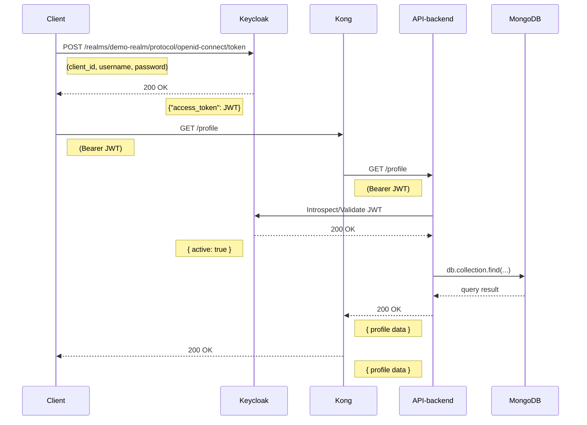

# Fiber + MongoDB + Keycloak + Kong Demo

This repository demonstrates a simple setup where:

* **Fiber** (Go) serves as a backend REST API  
* **MongoDB** stores application data  
* **Keycloak** (Quarkus) provides OpenID Connect / JWT-based authentication & authorization  
* **Kong** (Postgres-backed) acts as an API gateway  

Users are preconfigured via an import-realm file. Two test users exist:

* **alice** (password: `password123`) with the `user` role  
* **bob** (password: `password123`) with the `admin` role  

A public endpoint is exposed at `/public`, and protected endpoints are `/profile`, `/user` (role “user” only) and `/admin` (role “admin” only). The `/admin` route also demonstrates a MongoDB query.

---

## Table of Contents

- [Fiber + MongoDB + Keycloak + Kong Demo](#fiber--mongodb--keycloak--kong-demo)
  - [Table of Contents](#table-of-contents)
  - [Prerequisites](#prerequisites)
  - [Project Structure](#project-structure)
  - [How to Run](#how-to-run)
    - [1. Clone \& Build](#1-clone--build)
      - [Linux / macOS (bash or zsh)](#linux--macos-bash-or-zsh)
      - [Windows (PowerShell)](#windows-powershell)
    - [2. Launch with Docker Compose](#2-launch-with-docker-compose)
      - [Linux / macOS (bash or zsh)](#linux--macos-bash-or-zsh-1)
      - [Windows (PowerShell)](#windows-powershell-1)
    - [3. Verify Services Are Up](#3-verify-services-are-up)
      - [MongoDB](#mongodb)
      - [Keycloak](#keycloak)
      - [Kong](#kong)
      - [API-backend](#api-backend)
    - [4. Enable Direct Access Grants on the `fiber-app` Client](#4-enable-direct-access-grants-on-the-fiber-app-client)
  - [Sequence Diagram](#sequence-diagram)
  - [Getting a Keycloak Access Token](#getting-a-keycloak-access-token)
      - [Token Endpoint](#token-endpoint)
      - [Linux / macOS (bash or zsh)](#linux--macos-bash-or-zsh-2)
      - [Windows (PowerShell)](#windows-powershell-2)
  - [Testing the API-backend Endpoints](#testing-the-api-backend-endpoints)
    - [Public Endpoint](#public-endpoint)
      - [Linux / macOS (bash or zsh)](#linux--macos-bash-or-zsh-3)
      - [Windows (PowerShell)](#windows-powershell-3)
    - [Authenticated `/profile` Endpoint](#authenticated-profile-endpoint)
      - [Without a token](#without-a-token)
        - [Linux / macOS](#linux--macos)
        - [Windows](#windows)
      - [With a valid token (alice or bob)](#with-a-valid-token-alice-or-bob)
        - [Linux / macOS](#linux--macos-1)
        - [Windows](#windows-1)
    - [Role-Restricted Endpoints: `/user` \& `/admin`](#role-restricted-endpoints-user--admin)
      - [1. GET /user](#1-get-user)
        - [Linux / macOS](#linux--macos-2)
        - [Windows](#windows-2)
        - [Linux / macOS](#linux--macos-3)
        - [Windows](#windows-3)
      - [2. GET /admin](#2-get-admin)
        - [Linux / macOS](#linux--macos-4)
        - [Windows](#windows-4)
        - [Linux / macOS](#linux--macos-5)
        - [Windows](#windows-5)
  - [Use Kong API Gateway](#use-kong-api-gateway)
    - [Example: Call `/public` via Kong](#example-call-public-via-kong)
      - [Linux / macOS](#linux--macos-6)
      - [Windows](#windows-6)
    - [Example: Authenticated `/profile` via Kong](#example-authenticated-profile-via-kong)
      - [Linux / macOS](#linux--macos-7)
      - [Windows](#windows-7)
  - [Stopping \& Cleaning Up](#stopping--cleaning-up)
        - [Linux / macOS](#linux--macos-8)
        - [Windows](#windows-8)
        - [Linux / macOS](#linux--macos-9)
        - [Windows](#windows-9)
    - [Populating MongoDB (Example)](#populating-mongodb-example)
      - [Linux / macOS](#linux--macos-10)
      - [Windows](#windows-10)

---

## Prerequisites

* **Docker 20.10+** and **Docker Compose 1.29+** installed locally  
* Ports **27017**, **8080**, **8000**, **8001**, and **3000** free on your host  
* A terminal on your platform:  
  * **Linux/macOS**: bash or zsh  
  * **Windows**: PowerShell (or WSL)  

All services run in Docker containers—no additional installs are required on the host.

---

## Project Structure

```

.
├─ Dockerfile                   # Builds the Fiber Go app
├─ main.go                      # Fiber application code (handlers + JWT middleware)
├─ docker-compose.yml           # Sets up MongoDB, Keycloak (dev), Kong, and the Fiber app
├─ keycloak/
│   └─ import-realm.json        # Pre-configured realm, users, roles & client
├─ kong/
│   └─ kong.yml                 # Kong declarative config (routes to Fiber app)
├─ API-backend                  # container built from `Dockerfile`
└─ README.md                    # ← (this file)

````

* **main.go**  
  * Connects to MongoDB  
  * Exposes:  
    * `GET /public` (no auth)  
    * `GET /profile` (any valid JWT)  
    * `GET /user` (requires realm role `user`)  
    * `GET /admin` (requires realm role `admin`; counts documents in `items` collection)  

* **docker-compose.yml**  
  * **mongo** container (MongoDB 6.0)  
  * **keycloak-db** container (PostgreSQL 14 for Keycloak)  
  * **keycloak** container (Keycloak 21.1.1 in `start-dev` mode)  
  * **kong-database** (PostgreSQL 14 for Kong)  
  * **kong** (Kong 3.5, declarative mode via `kong.yml`)  
  * **app** (container built from `Dockerfile`)  

* **keycloak/import-realm.json**  
  * Defines a realm `demo-realm`  
  * Two users:  
    * `alice` / `password123` (realm role `user`)  
    * `bob` / `password123` (realm role `admin`)  
  * One public-client `fiber-app` (no secret, redirect URIs = `*`)  

* **kong/kong.yml**  
  * Declarative config that proxies requests to the Fiber app at `http://app:3000`  

---

## How to Run

### 1. Clone & Build

#### Linux / macOS (bash or zsh)

```bash
git clone https://github.com/your-username/fiber-mongo-keycloak-kong-demo.git
cd fiber-mongo-keycloak-kong-demo
````

#### Windows (PowerShell)

```powershell
git clone https://github.com/your-username/fiber-mongo-keycloak-kong-demo.git
Set-Location fiber-mongo-keycloak-kong-demo
```

Make sure `keycloak/import-realm.json` and `kong/kong.yml` exist.

---

### 2. Launch with Docker Compose

#### Linux / macOS (bash or zsh)

```bash
docker-compose up --build -d
```

#### Windows (PowerShell)

```powershell
docker-compose up --build -d
```

* `--build` forces rebuilding the Fiber app image
* `-d` runs all containers in detached mode

Wait about 20 seconds for all services to become healthy:

* **MongoDB**: should log “Waiting for connections”
* **Keycloak**: finishes importing the realm and logs “Keycloak … started in X s”
* **Kong**: logs worker processes and “declarative config loaded”
* **API-backend**: logs “Connected to MongoDB: mongodb://mongo:27017” and “Fiber v2… listening on :3000”

---

### 3. Verify Services Are Up

#### MongoDB

**Linux / macOS (bash or zsh)**

```bash
docker-compose logs mongo --tail=10
```

**Windows (PowerShell)**

```powershell
docker-compose logs mongo --tail 10
```

You should see output like:

```
… "Waiting for connections" …
```

#### Keycloak

**Linux / macOS**

```bash
docker-compose logs keycloak --tail=10
```

**Windows**

```powershell
docker-compose logs keycloak --tail 10
```

You should see:

```
… Keycloak 21.1.1 on JVM … started in X s. Listening on: http://0.0.0.0:8080
```

#### Kong

**Linux / macOS**

```bash
docker-compose logs kong --tail=10
```

**Windows**

```powershell
docker-compose logs kong --tail 10
```

Look for lines like:

```
… start worker process …
… declarative config loaded …
```

#### API-backend

**Linux / macOS**

```bash
docker-compose logs app --tail=10
```

**Windows**

```powershell
docker-compose logs app --tail 10
```

You should see:

```
Connected to MongoDB: mongodb://mongo:27017
Fiber v2.xx.x              http://127.0.0.1:3000
```

---

### 4. Enable Direct Access Grants on the `fiber-app` Client

Before fetching tokens via the password grant, you need to log in and enable Direct Access Grants:

1. Open your browser to [http://localhost:8080](http://localhost:8080)
2. Click **Administration Console**
3. Sign in with the Keycloak admin credentials:

   * **Username**: `admin`
   * **Password**: `admin`
4. In the top-left realm dropdown, switch to **demo-realm**
5. In the sidebar, go to **Manage → Clients**, and click **fiber-app**
6. Open **Access settings** (or **Capability config**) and toggle on **Direct Access Grants**
7. Click **Save**

---

## Sequence Diagram



---

## Getting a Keycloak Access Token

Before calling any protected endpoint, you must log in to Keycloak and obtain a JWT.

#### Token Endpoint

```
http://localhost:8080/realms/demo-realm/protocol/openid-connect/token
```

We use the Resource Owner Password Credentials grant:

* **client\_id**: `fiber-app` (public client, no secret)
* **username**: `alice` / `password123` → role `user`
* **username**: `bob` / `password123` → role `admin`

---

#### Linux / macOS (bash or zsh)

```bash
KC_URL="http://localhost:8080/realms/demo-realm/protocol/openid-connect/token"

# Alice's token (role “user”)
ALICE_TOKEN=$(
  curl -s -X POST "$KC_URL" \
    -H "Content-Type: application/x-www-form-urlencoded" \
    -d "client_id=fiber-app" \
    -d "grant_type=password" \
    -d "username=alice" \
    -d "password=password123" \
    | jq -r ".access_token"
)

# Bob's token (role “admin”)
BOB_TOKEN=$(
  curl -s -X POST "$KC_URL" \
    -H "Content-Type: application/x-www-form-urlencoded" \
    -d "client_id=fiber-app" \
    -d "grant_type=password" \
    -d "username=bob" \
    -d "password=password123" \
    | jq -r ".access_token"
)
```

---

#### Windows (PowerShell)

```powershell
$KC_URL = "http://localhost:8080/realms/demo-realm/protocol/openid-connect/token"

$responseAlice = Invoke-RestMethod -Method Post -Uri $KC_URL `
  -ContentType "application/x-www-form-urlencoded" `
  -Body @{
    client_id    = "fiber-app"
    grant_type   = "password"
    username     = "alice"
    password     = "password123"
  }
$ALICE_TOKEN = $responseAlice.access_token

$responseBob = Invoke-RestMethod -Method Post -Uri $KC_URL `
  -ContentType "application/x-www-form-urlencoded" `
  -Body @{
    client_id    = "fiber-app"
    grant_type   = "password"
    username     = "bob"
    password     = "password123"
  }
$BOB_TOKEN = $responseBob.access_token
```

---

## Testing the API-backend Endpoints

The API-backend listens on **port 3000**. You can call it directly (port 3000) or through Kong (port 8000) if enabled.

---

### Public Endpoint

No JWT required.

#### Linux / macOS (bash or zsh)

```bash
curl -i http://localhost:3000/public
```

#### Windows (PowerShell)

```powershell
Invoke-RestMethod -Method Get -Uri http://localhost:3000/public -UseBasicParsing
```

**Expected Response**:

```http
HTTP/1.1 200 OK
Content-Type: application/json; charset=utf-8

{"message":"This is a public endpoint."}
```

---

### Authenticated `/profile` Endpoint

Requires a valid JWT from Keycloak.

#### Without a token

##### Linux / macOS

```bash
curl -i http://localhost:3000/profile
```

##### Windows

```powershell
Invoke-RestMethod -Method Get -Uri http://localhost:3000/profile -UseBasicParsing
```

**Expected Response**:

```http
HTTP/1.1 401 Unauthorized
Content-Type: application/json; charset=utf-8

{"error":"Unauthorized - Missing or malformed JWT"}
```

#### With a valid token (alice or bob)

(substitute `$ALICE_TOKEN` or `$BOB_TOKEN` accordingly)

##### Linux / macOS

```bash
curl -i \
  -H "Authorization: Bearer $ALICE_TOKEN" \
  http://localhost:3000/profile
```

##### Windows

```powershell
Invoke-RestMethod -Method Get -Uri http://localhost:3000/profile `
  -Headers @{ Authorization = "Bearer $ALICE_TOKEN" } `
  -UseBasicParsing
```

**Example Response (alice’s token)**:

```json
{
  "message":"Hello, alice",
  "roles":{"roles":["user"]},
  "subject":"<Keycloak-assigned-UUID>",
  "issuedAt":163XXXXXXX
}
```

---

### Role-Restricted Endpoints: `/user` & `/admin`

* **`GET /user`**: only JWTs with realm role `user` can access
* **`GET /admin`**: only JWTs with realm role `admin` can access; also counts documents in MongoDB

#### 1. GET /user

* **alice** (role `user`) should succeed:

##### Linux / macOS

```bash
curl -i \
  -H "Authorization: Bearer $ALICE_TOKEN" \
  http://localhost:3000/user
```

##### Windows

```powershell
Invoke-RestMethod -Method Get -Uri http://localhost:3000/user `
  -Headers @{ Authorization = "Bearer $ALICE_TOKEN" } `
  -UseBasicParsing
```

**Response**:

```json
{"message":"Hello, user-level endpoint!"}
```

* **bob** (role `admin` only) → 403 Forbidden:

##### Linux / macOS

```bash
curl -i \
  -H "Authorization: Bearer $BOB_TOKEN" \
  http://localhost:3000/user
```

##### Windows

```powershell
Invoke-RestMethod -Method Get -Uri http://localhost:3000/user `
  -Headers @{ Authorization = "Bearer $BOB_TOKEN" } `
  -UseBasicParsing
```

**Response**:

```json
{"error":"Missing role: user"}
```

#### 2. GET /admin

* **bob** (role `admin`) succeeds: returns `"itemCountDB": 0` if `items` is empty.

##### Linux / macOS

```bash
curl -i \
  -H "Authorization: Bearer $BOB_TOKEN" \
  http://localhost:3000/admin
```

##### Windows

```powershell
Invoke-RestMethod -Method Get -Uri http://localhost:3000/admin `
  -Headers @{ Authorization = "Bearer $BOB_TOKEN" } `
  -UseBasicParsing
```

**Response**:

```json
{
  "message":"Hello, admin-level endpoint!",
  "itemCountDB":0
}
```

* **alice** (missing `admin` role) → 403 Forbidden:

##### Linux / macOS

```bash
curl -i \
  -H "Authorization: Bearer $ALICE_TOKEN" \
  http://localhost:3000/admin
```

##### Windows

```powershell
Invoke-RestMethod -Method Get -Uri http://localhost:3000/admin `
  -Headers @{ Authorization = "Bearer $ALICE_TOKEN" } `
  -UseBasicParsing
```

**Response**:

```json
{"error":"Missing role: admin"}
```

---

## Use Kong API Gateway

Kong runs with a Postgres backend (via the `kong-database` service) and proxies all incoming requests on:

- **8000** (HTTP)  
- **8443** (HTTPS)

### Example: Call `/public` via Kong

#### Linux / macOS

```bash
curl -i http://localhost:8000/public
```

#### Windows

```powershell
Invoke-RestMethod -Method Get -Uri http://localhost:8000/public -UseBasicParsing
```

**Response**:

```json
{"message":"This is a public endpoint."}
```

### Example: Authenticated `/profile` via Kong

#### Linux / macOS

```bash
curl -i \
  -H "Authorization: Bearer $ALICE_TOKEN" \
  http://localhost:8000/profile
```

#### Windows

```powershell
Invoke-RestMethod -Method Get -Uri http://localhost:8000/profile `
  -Headers @{ Authorization = "Bearer $ALICE_TOKEN" } `
  -UseBasicParsing
```

**Response** (same as direct call):

```json
{
  "message":"Hello, alice",
  "roles":{"roles":["user"]},
  "subject":"<…>",
  "issuedAt":…
}
```

> Kong runs as a core part of this stack, proxying all requests through port 8000/8443.

---

## Stopping & Cleaning Up

1. **Stop all containers**:

   ##### Linux / macOS

   ```bash
   docker-compose down
   ```

   ##### Windows

   ```powershell
   docker-compose down
   ```

2. **Remove named volumes** (MongoDB & Kong data):

   ##### Linux / macOS

   ```bash
   docker-compose down -v
   ```

   ##### Windows

   ```powershell
   docker-compose down -v
   ```

---

### Populating MongoDB (Example)

To insert a sample document into the `items` collection:

#### Linux / macOS

```bash
docker exec -it demo_mongo \
  mongo demo_db --eval 'db.items.insertOne({ name: "widget", price: 9.99 });'
```

#### Windows

```powershell
docker exec -it demo_mongo `
  mongo demo_db --eval 'db.items.insertOne({ name: "widget", price: 9.99 });'
```
