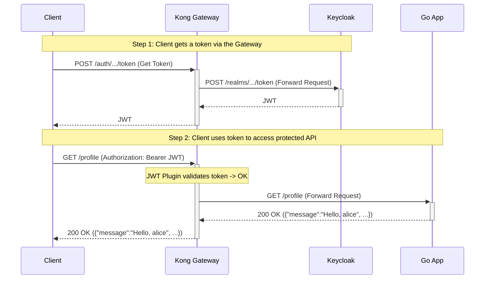

# Secure Go API with Kong and Keycloak

This project demonstrates a complete, production-ready setup for securing a Go backend API using **Kong** as an API Gateway and **Keycloak** for identity and access management.

This final version uses a best-practice approach where **all** traffic, including authentication requests, is proxied through the Kong gateway. Kong's configuration is applied dynamically and automatically via a robust script.

## Architecture

In this secure architecture, the **only** entry point for external traffic is the Kong Gateway. The Go API and Keycloak are isolated within the internal Docker network.

```
+--------+            +-------------------+      +-----------------+
|        |----------->|                   |----->| Keycloak        |
| Client |            |   Kong Gateway    |      | (for /auth/...) |
|        |            |   (Port :8081)    |      +-----------------+
|        |<---------- |                   |
+--------+            |  - JWT Validation |      +-----------------+
                      |  - Routing        |----->|  Go Backend API |
                      |                   |      | (for API calls) |
                      |                   |      +-----------------+
                      +-------------------+
```

1.  A **Client** requests a JWT from the Kong Gateway's `/auth` endpoint.
2.  **Kong** forwards this request to the internal **Keycloak** instance.
3.  Keycloak returns a JWT to the client, proxied back through Kong.
4.  The Client then makes a request to a protected API endpoint (e.g., `/profile`) on the Kong Gateway, including the JWT.
5.  **Kong** intercepts the request, and its `jwt` plugin validates the token's signature using Keycloak's public key.
6.  If valid, Kong forwards the request to the upstream **Go Backend API**.
7.  The **Go Backend API** trusts the request and processes it.

## Request Flow Diagram

This diagram shows the complete flow, from getting a token to accessing a protected resource, all through the gateway.



## Project Structure

```
.
├── docker-compose.yml        # Main orchestrator for all services
├── Dockerfile                # For the Go application
├── configure-kong.ps1        # Windows script to configure Kong
├── configure-kong.sh         # Linux/macOS script to configure Kong
├── go.mod                    
├── go.sum
├── main.go                   # Go backend application source code
│
└── keycloak/
    └── import-realm.json     # Keycloak realm, user, and client definitions
```

## Prerequisites

*   [Docker](https://www.docker.com/get-started) & [Docker Compose](https://docs.docker.com/compose/install/)
*   **For Linux/macOS users:** You must have `curl`, `jq`, and `openssl` installed.

## How to Run

1.  **Clean up previous volumes (Important):**
    ```bash
    docker-compose down -v
    ```

2.  **Build and start all services:**
    ```bash
    docker-compose up --build -d
    ```

3.  **Wait for all services to initialize (critical step):**
    Wait about **60-90 seconds**. You can monitor the status with `docker-compose ps`.

4.  **Configure Kong automatically using the correct script for your OS:**

    *   **On Windows (PowerShell):**
        ```powershell
        .\configure-kong.ps1
        ```

    *   **On Linux or macOS (Bash/Shell):**
        ```bash
        chmod +x configure-kong.sh && ./configure-kong.sh
        ```
    The script will output its progress, creating services, routes, and security credentials.

## Testing the Endpoints

After the configuration script has run, your gateway is ready to test.

**1. Get an Access Token for `alice` (THROUGH THE GATEWAY):**
```powershell
$resp = Invoke-RestMethod -Method Post `
  -Uri http://localhost:8081/auth/realms/demo-realm/protocol/openid-connect/token `
  -ContentType "application/x-www-form-urlencoded" `
  -Body @{ grant_type = 'password'; client_id = 'fiber-app'; username = 'alice'; password = 'password123' }
$token = $resp.access_token
```

**2. Test the Public Endpoint (succeeds):**
```bash
curl http://localhost:8081/public
```

**3. Test the Profile Endpoint (succeeds):**
```bash
curl -H "Authorization: Bearer $token" http://localhost:8081/profile
```

**4. Test without a Token (fails with 401):**
```bash
curl -v http://localhost:8081/profile
```

---

## Deep Dive: The Configuration Explained

### 1. Keycloak (`keycloak/import-realm.json`)

*   **Realm Roles Mapper:** We add a **Protocol Mapper** to Keycloak to extract the user's roles into a simple, top-level `roles` claim in the JWT. This is easier for our Go application to parse. The key setting is **`"multivalued": "true"`**, which ensures the roles are a proper JSON array.

### 2. Kong (configured via script)

*   **Proxied Keycloak:** We create a dedicated **Service** (`keycloak-svc`) and **Route** (`/auth`) in Kong. This proxies all authentication-related traffic to the internal Keycloak instance, hiding it from the public and providing a single domain for all client interactions. The configuration script itself uses this proxy to fetch the public keys.

*   **Route-Based Security:** The `jwt` plugin is attached **only** to the routes that need protection (`/profile`, `/user`, `/admin`). The `/public` and `/auth` routes are left open. This provides granular and explicit security control.

*   **Robust Public Key Handling:** The configuration script fetches the JWK from Keycloak (via the proxy) and uses cryptographic libraries to convert the **`n` (modulus)** and **`e` (exponent)** components into a standard **PEM-formatted public key**. This is the most reliable way to register an RSA key with Kong's built-in JWT plugin.

### 3. Go Application (`main.go`)

*   **Trusting the Gateway:** The most important architectural decision is to **remove JWT validation middleware from the Go application**. We trust that any request reaching the app has already been authenticated by Kong.

*   **Authorization vs. Authentication:** While the Go app doesn't re-authenticate the user, it still performs **authorization**. For the `/user` and `/admin` endpoints, it parses the token (without verifying the signature) and checks the `roles` claim to ensure the user has the correct permissions for that specific action. This is a perfect separation of concerns.