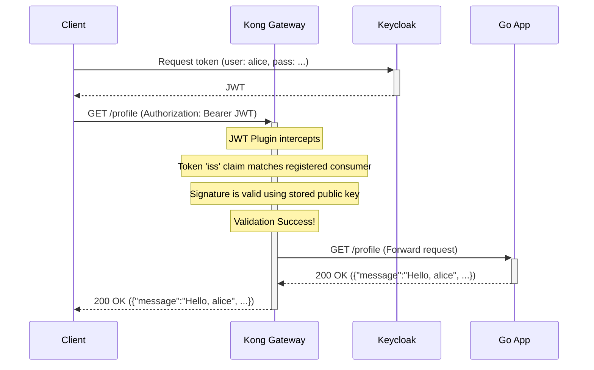
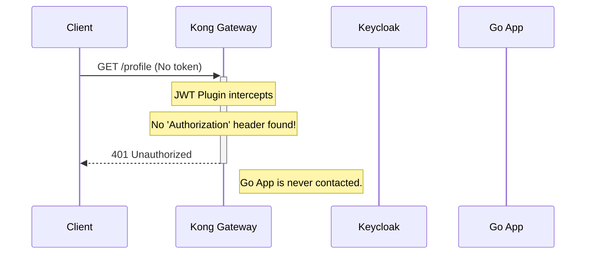

# Secure Go API with Kong and Keycloak

This project demonstrates a complete, production-ready setup for securing a Go backend API using **Kong** as an API Gateway and **Keycloak** for identity and access management.

It serves as a reference implementation that handles:
*   **Centralized Authentication:** All JWT validation is offloaded to the Kong gateway using its built-in `jwt` plugin.
*   **Dynamic Configuration:** Kong is run in DB-backed mode, allowing for configuration changes via an Admin API without restarts.
*   **Automated Setup:** A simple script automates the entire Kong configuration process on startup.
*   **Robust Service Startup:** The startup sequence is carefully managed to prevent common race conditions between services.

## Architecture

The request flow is as follows:

```
                      +-------------------+      +-----------------+
                      |                   |      | Keycloak        |
                      |   Kong Gateway    |<---->| (Identity Prov.)|
+--------+            |   (Port :8081)    |      +-----------------+
|        |            |                   |
| Client +----------->|  - JWT Validation |      +-----------------+
|        |            |  - Routing        |----->|  Go Backend API |
+--------+            |                   |      |  (Port :3000)   |
                      |                   |      +-----------------+
                      +-------------------+
```

1.  A **Client** obtains a JWT from Keycloak.
2.  The Client makes a request to a protected endpoint on the **Kong Gateway**, including the JWT in the `Authorization` header.
3.  **Kong** intercepts the request and its `jwt` plugin activates.
    *   It inspects the token's `iss` (issuer) claim to identify the origin.
    *   It looks up the corresponding "Consumer" and finds the registered public key for that issuer.
    *   It validates the token's signature, issuer, and expiration.
4.  If validation succeeds, Kong forwards the request to the upstream **Go Backend API**.
5.  The **Go Backend API** trusts the request (as it came from the gateway) and processes it without re-validating the token.

## Request Flow Diagrams

### 1. Successful Request to a Protected Endpoint

This diagram shows the flow when a client with a valid token accesses a protected endpoint like `/profile`.



### 2. Unauthorized Request (No Token)

This diagram shows how Kong blocks requests to protected endpoints that are missing a token.



## Project Structure

```
.
├── docker-compose.yml        # Main orchestrator for all services
├── Dockerfile                # For the Go application
├── configure-kong.ps1        # Windows script to configure Kong
├── configure-kong.sh         # Linux/macOS script to configure Kong
├── go.mod                    
├── go.sum
├── main.go                   # Go backend application source code
│
└── keycloak/
    └── import-realm.json     # Keycloak realm, user, and client definitions
```

## Prerequisites

*   [Docker](https://www.docker.com/get-started) & [Docker Compose](https://docs.docker.com/compose/install/)
*   **For Linux/macOS users:** You must have `curl`, `jq`, and `openssl` installed.
    *   *Ubuntu/Debian:* `sudo apt-get install -y curl jq openssl`
    *   *macOS (Homebrew):* `brew install curl jq openssl`

## How to Run

1.  **Clean up previous volumes (Important for a fresh start):**
    ```bash
    docker-compose down -v
    ```

2.  **Build and start all services:**
    The `--build` flag is only needed if you change the Go application's `Dockerfile`.
    ```bash
    docker-compose up --build -d
    ```

3.  **Wait for all services to initialize.**
    This is a critical step. Wait about **60-90 seconds** for all services to start. You can monitor the status with `docker-compose ps`.

4.  **Configure Kong automatically using the correct script for your OS:**

    *   **On Windows (PowerShell):**
        ```powershell
        .\configure-kong.ps1
        ```

    *   **On Linux or macOS (Bash/Shell):**
        First, make the script executable: `chmod +x configure-kong.sh`, then run it:
        ```bash
        ./configure-kong.sh
        ```
    You should see output confirming that the service, routes, and credentials were created successfully.

## Testing the Endpoints

After the configuration script has run, your gateway is ready to test.

**1. Get an Access Token for `alice`:**
*This example uses PowerShell, but you can use any HTTP client.*
```powershell
$resp = Invoke-RestMethod -Method Post `
  -Uri http://localhost:8080/realms/demo-realm/protocol/openid-connect/token `
  -ContentType "application/x-www-form-urlencoded" `
  -Body @{ grant_type = 'password'; client_id = 'fiber-app'; username = 'alice'; password = 'password123' }
$token = $resp.access_token
```

**2. Test the Public Endpoint (succeeds):**
```bash
curl http://localhost:8081/public
```

**3. Test the Profile Endpoint (succeeds):**
```bash
# In PowerShell:
curl -H "Authorization: Bearer $token" http://localhost:8081/profile
```

**4. Test without a Token (fails with 401):**
```bash
curl -v http://localhost:8081/profile
```

---

## Deep Dive: The Configuration Explained

### 1. Keycloak (`keycloak/import-realm.json`)

To ensure the backend application receives the necessary role information, we add a **Protocol Mapper** to the `fiber-app` client definition in Keycloak.

*   **Realm Roles Mapper:**
    This mapper extracts the user's roles and adds them to a simple, top-level `roles` claim in the JWT. This is easier for backend services to parse than the default nested structure.
    ```json
    {
      "name": "Realm Roles",
      "protocol": "openid-connect",
      "protocolMapper": "oidc-usermodel-realm-role-mapper",
      "config": {
        "access.token.claim": "true",
        "claim.name": "roles",
        "multivalued": "true"
      }
    }
    ```
    The key here is **`"multivalued": "true"`**, which ensures the output is a proper JSON array (`["user"]`).

### 2. Kong (configured via `configure-kong.ps1` or `.sh`)

*   **Service & Route Decoupling:** Kong separates the definition of your upstream API (the **Service**) from the public-facing paths that access it (the **Routes**). This allows for flexible routing. We create one service for our Go app and attach multiple routes (`/public`, `/profile`, etc.) to it.

*   **Route-Based Security:** Instead of protecting the entire service, we apply the `jwt` plugin **only to the routes that need protection**. This is a granular and explicit way to manage security. The `/public` route is left without the plugin, making it open to all traffic.

*   **JWT Credential & Consumer:**
    The core of the security setup lies in how we teach Kong to trust Keycloak's tokens.
    1.  We create a generic **Consumer** named `keycloak-users`.
    2.  We use the configuration script to fetch Keycloak's public signing key.
    3.  We register this key as a **JWT Credential** for the `keycloak-users` consumer. The most important part is that the `key` of this credential is set to the **issuer URL** (e.g., `http://localhost:8080/realms/demo-realm`).
    *   **How it works:** When Kong receives a token, it reads the `iss` (issuer) claim. It then looks for a JWT credential with a matching `key`. Once found, it uses the associated `rsa_public_key` to validate the token's signature. This is a robust mechanism that allows Kong to handle tokens from multiple issuers simultaneously.

### 3. Go Application (`main.go`)

*   **Trusting the Gateway:**
    The most important architectural decision is to **remove JWT validation middleware from the Go application**. We trust that any request reaching the app from the internal Docker network has already been authenticated and authorized by Kong.
    **Problem Solved:** Eliminates brittle, redundant validation logic in the backend, which often fails due to subtle configuration differences (e.g., `localhost` vs. container hostnames).

*   **Parsing Claims without Validation:**
    The handlers still need user information from the token (like username or roles). We use a helper function to parse the JWT from the `Authorization` header **without verifying its signature**, since we trust Kong has already done that.
    ```go
    token, _, err := new(jwt.Parser).ParseUnverified(tokenString, jwt.MapClaims{})
    ```